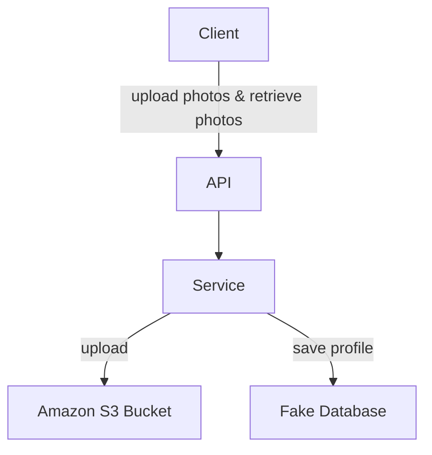

# AWS IMAGE UPLOAD
A simple web application for image upload to amazon web service. I used **spring boot** and **react** frameworks in this application.Also i used dependency injection and solid principles.
# Dependencies

 1. [React dropzone](https://github.com/react-dropzone/react-dropzone) is simple React hook to create a HTML5-compliant drag'n'drop zone for files.
 2. [Axios](https://github.com/axios/axios) is promise based HTTP client for the browser and node.js
 3. [AWS Sdk](https://mvnrepository.com/artifact/com.amazonaws/aws-java-sdk) The Amazon Web Services SDK for Java provides Java APIs for building software on AWS' cost-effective, scalable, and reliable infrastructure products.

## Project Flow Chart

## Project gif
